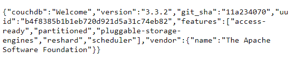
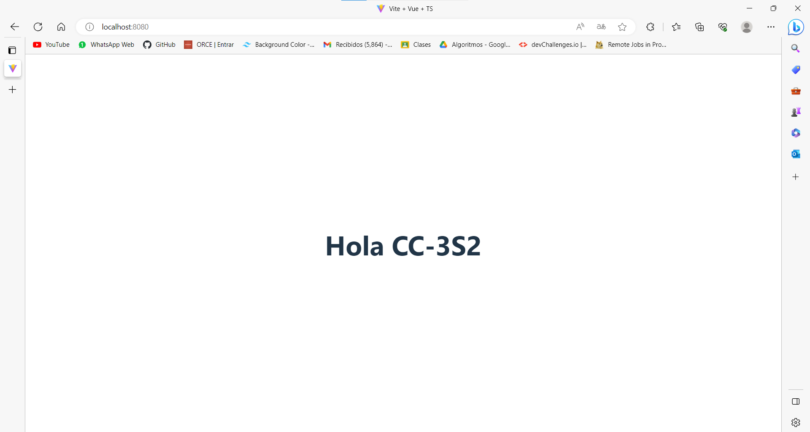

# Ejercicio
Ejecuta CouchDB como un contenedor de Docker y publica su puerto, de la siguiente manera
- Ejecuta el contenedor.
- Publica el puerto de CouchDB.
- Abre el navegador y verifica que CouchDB esté disponible.

Crea una imagen de Docker con un servicio REST y responda Hola CC-3S2 al localhost:8080/hola. Utiliza el lenguaje y el framework que prefieras.

## Respuesta
- Primero descargamos la imagen de CouchDB con el siguiente comando
```
docker pull couchdb
```
- Ahora creamos y ejecutamos el contenedor de CouchDB cuyo nombre será "couchdb-container" en el puerto 5984 
```
docker run -p 5984:5984 --name couchdb-container -d couchdb
``` 
- Accedemos a localhost:5984 y este sería el resultado



- Creamos un aplicación Vite + Vue 3 con el siguiente comando

```
npm create vite@latest
```

- Creamos el Dockerfile en el directorio raíz del proyecto
```Docker
# Usar la imagen base de Node.js
FROM node:lts-alpine

RUN npm install -g http-server

# Establecer el directorio de trabajo en /app
RUN mkdir /app

WORKDIR /app

# Copiar el archivo package.json y package-lock.json
COPY package*.json ./

# Instalar las dependencias del proyecto
RUN npm install

# Copiar el resto de los archivos del proyecto
COPY . .

# Compilar la aplicación para producción
RUN npm run build

# Exponer el puerto 8080
EXPOSE 8080

CMD ["http-server","dist"]
```
- Creamos el .dockerignore
```Docker
.dockerignore
Dockerfile
node_modules
.vscode
```

- Construimos la imagen llamada 'vue-img' con el siguiente comando

```
docker build -t vue-img .
```

- Ejecutamos el siguiente comando para empezar a correr la aplicación en el puerto 8080

```
docker run -p 8080:8080 vue-img
```

- Resultado final

