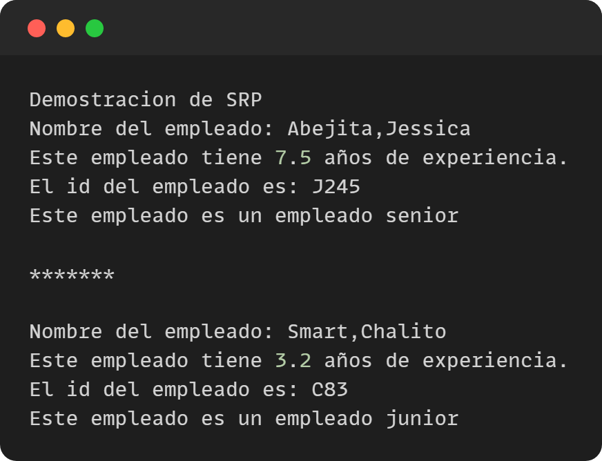

**Single Responsability Principle (SRP)**

**Demostración sin SRP**

**¿Cuál es el problema con este diseño?**

La clase Empleado tiene dos responsabilidades distintas, mostrar los detalles del empleado y generar el ID del empleado. En el método generateEmpId, estás generando el ID del empleado, pero también está actualizando el estado de la instancia de Empleado.

**Demostración con SRP**

**Explicación de resultados**

- La clase Cliente es la que se encarga de crear instancias de Empleado y llamar al método showEmpDetail para mostrar los detalles del empleado, generar el ID del empleado y verificar su nivel laboral. 
- El método showEmpDetail llama a diferentes clases para realizar estas tareas.
- La clase Empleado solo se encarga de almacenar la información del empleado, como el nombre, el apellido y los años de experiencia. 
- La clase GeneradorIDEmpleado se encarga de generar el ID del empleado 
- La clase SeniorityChecker se encarga de verificar el nivel laboral del empleado.

**Open Closed Principle (OCP)**

**Demostración sin OCP**

**Modifica el método de evaluateDistinction() y agrega otra instrucción if para considerar a los estudiantes de comercio. ¿Está bien modificar el método evaluateDistinction()de esta manera?.**

No está bien modificar el método evaluateDistinction(), ya que violaría el principio de Open-Closed (OCP) de SOLID. En este caso la modificación directa del método evaluateDistinction() para incluir a los estudiantes de comercio viola este principio, ya que si se agregara otra categoría en el futuro, se tendría que modificar nuevamente el método y se rompería el principio de OCP.

**Demostración con OCP**

**¿Cuáles son las principales ventajas ahora?**

En este caso una de las ventajas sería que si se quisiera agregar un nuevo tipo de estudiante, como por ejemplo, un estudiante de negocios, se podría crear una nueva clase llamada BusinessStudent que implemente la interfaz Estudiante y agregarla a las listas de estudiantes sin necesidad de modificar el código existente. Además, si se quisiera agregar un nuevo criterio de distinción para los estudiantes, se podría crear una nueva clase que implemente la interfaz DistinctionDecider y agregarla al código sin necesidad de modificar las clases existentes. De esta manera, el código se vuelve más flexible y se pueden hacer cambios sin afectar la funcionalidad existente, lo que facilita su mantenimiento y extensión en el futuro.

