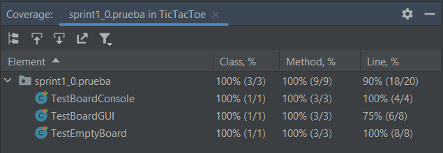
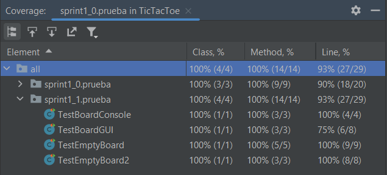

# Sprint 1
## Pregunta
Explica el funcionamiento de los siguientes código dentro del sprint1.

```Java
public class TestBoardConsole {
    private Board board;

    @Before
    public void setUp() throws Exception {
   	 board = new Board();
    }

    @After
    public void tearDown() throws Exception {
    }

    @Test
    public void testEmptyBoard() {
   	 new Console(board).displayBoard();
    }

}

``` 
```Java
public class Console {
    private Board board;

    public Console(Board board) {
   	 this.board = board;
    }

    public void displayBoard() {
   	 for (int row = 0; row<3; row++) {
   		 System.out.println("-------");
   		 System.out.print("|"+ board.getCell(row, 0));
   		 System.out.print("|"+ board.getCell(row, 1));
   		 System.out.print("|"+ board.getCell(row, 2));
   		 System.out.println("|");
   	 }
   	 System.out.println("-------");
    }
}
```
**Respuesta**

public class TestBoardConsole
- Primero se instancia un Board (tablero)
- El ```@Before``` indica que el método ```setUp()``` se ejecuta antes del test
- El ```@After``` indica que el método ```tearDown()``` se ejecuta después del test
- El método ```testEmptyBoard()``` comprueba si se muestra un tablero vacío en consola

public class Console
- Primero se instancia un Board (tablero)
- Se define el constructor de la clase Console
- El método ```displayBoard()``` muestra un tablero 3x3

## Pregunta
¿Se necesita refactorización?
```Java
//nos regresa un valor:
//-1 si es una casilla fuera de los límites
//el valor de la casilla si es una casilla válida
public int getCell(int row, int column){
       if(row >= 0 && row < 3 && column >= 0 && column < 3)
           return grid[row][column]; 
      else
           return -1
    }
```

**Respuesta**

Sí, ya que no se entiende el ```return -1```, implementar otra clase haciendo referencia a este valor solucionaría el problema.

## Pregunta
Realiza la cobertura de código. Explica tus respuestas.

**Respuesta**

Para el Sprint1_0

Se observa que en el test TestBoardGUI solo se verificaron las líneas de código en un 75%



Para el Sprint1_1

De igual manera en el test TestBoardGUI solo se verificó un 75% de las líneas de código


# Sprint 2

## Pregunta 
Completar los siguientes criterios de aceptación 

## Respuesta

```
AC 2.1 Un movimiento X válido 
Dado un juego en curso con el turno de X
Cuando X realiza un movimiento a una celda vacía
Entonces se llena la celda con X
Y el turno se cambia a 0
``` 
```
AC 2.2 Un movimiento X ilegal en una celda ocupada
Dado un juego en curso con el turno de X
Cuando X realiza un movimiento a una celda ocupada 
Entonces la celda se mantiene tal cual
Y no se pasa de turno 
 ```
 
 ```
 AC 2.3 Un movimiento X ilegal fuera del tablero 
 Dado un juego en curso con el turno de X
 Cuando X realiza un movimiento a una celda fuera del tablero
 Entonces la celda se mantiene tal cual
 Y no se pasa de turno 
```

```
AC 3.1 Un movimiento O válido
Dado un juego en curso con el turno de O 
Cuando el jugador O hace un movimiento válido
Entonces se coloca O en la celda
Y el turno se cambia a X 
``` 

```
AC 3.2 Un movimiento O ilegal en una celda ocupada 
Dado un juego en curso con el turno de O 
Cuando el jugador O hace un movimiento ilegal dentro del tablero 
Entonces no se cambia la celda 
Y no se cambia el turno  
``` 
 
```
 AC 3.3 Un movimiento O ilegal fuera del tablero 
 Dado un juego en curso con el turno de O 
 Cuando el jugador O hace un movimiento ilegal fuera del tablero 
 Entonces la celda no se cambia
 Y no se cambia el turno
 ```

# Sprint 3
## Pregunta (V/F)
La secuencia de cuatro movimientos, `X (0,0), O (1,1), X (0,1), O (1,0)` no cumple la  necesidad. 

**Respuesta**

Verdadero, dado que ni X ni O ganan el juego.
## Pregunta
Para hacer que `testXWon` pase, `updateGameState` se enfoca en los escenarios `CROSS_WON`. Indica  al menos tres pruebas para `AC4.1` para cubrir tres X seguidas de manera horizontal, vertical y diagonal.

**Respuesta**

Horizontal

```Java

// Horizontal

@Test
public void testXWonHorizontal(){
     board.makeMove(0, 0);
     board.makeMove(2, 1);
     board.makeMove(0, 1);
     board.makeMove(1, 1);
     board.makeMove(0, 2);

      assertEquals(“ ”, board.getGamesState(); GameState. CROSS_WON);
      new GUI(board);
      try {
             Thread.sleep(2000);
          } catch (InterruptedException e) {
               e.printStackTrace();
       }
}

// Vertical

@Test
public void testXWonVertical(){
     board.makeMove(0, 0);
     board.makeMove(1, 1);
     board.makeMove(1, 0);
     board.makeMove(1, 2);
     board.makeMove(2, 0);

      assertEquals(“ ”, board.getGamesState(); GameState. CROSS_WON);
      new GUI(board);
      try {
             Thread.sleep(2000);
          } catch (InterruptedException e) {
               e.printStackTrace();
       }
}

// Diagonal

@Test
public void testXWonDiagonal(){
     board.makeMove(0, 0);
     board.makeMove(2, 1);
     board.makeMove(1, 1);
     board.makeMove(1, 0);
     board.makeMove(2, 2);

      assertEquals(“ ”, board.getGamesState(); GameState. CROSS_WON);
      new GUI(board);
      try {
             Thread.sleep(2000);
          } catch (InterruptedException e) {
               e.printStackTrace();
       }
}
```
## Pregunta

¿`AC4.3` es similar a `AC 4.1` ?. ¿Se trata de los escenarios `NAUGHT_WON`?. 

¿Toda las pruebas para `AC4.1-AC4.5` permitirán completar la clase de `Board`?. 

**Respuesta**

- 
- 

## Pregunta
¿ Cuál es el problema de initialBoard  y por que le cambiamos el nombre a `resetGame`. 

El nombre de la clase, `Board`, no explica claramente la abstracción. Se trata más del juego de tictactoe que del tablero de juego. 

Por lo tanto, le cambiamos el nombre a `TicTacToeGame` y cambiamos el nombre de la clase `GUI` a `TicTacToeGUI`.

**Respuesta**

## Pregunta

Verifica esto en el código del paquete del proyecto TicTacToe entregado.

**Respuesta**
